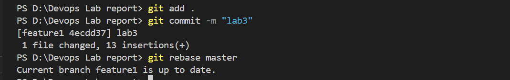

# DevOps-LABFILE

# LAB-1 GIT COMMANDS

git clone https://github.com/Abhishek71h/Devops-lab-report.git


```bash
git add .
git commit -m "figure 1"
git push

```bash
git add .
git commit -m "figure 1"
git push
```


`git status`


`git diff`


# LAB-2 GIT COMMANDS
*BRANCHING*


Create a file and do 3 commits in it
1st change
```bash
git add .
git commit -m "version1"
```

2nd change
```bash
git add .
git commit -m "version1"
```

3rd change
```bash
git add .
git commit -m "version3"
```

View all commits by using git log

```bash
git log
```


```bash
git branch featur1
git log
```


CREATE NEW FILE AND ADD TWO COMMITS
```bash
git add .
git commit -m "feature commit 1"
```

```bash
git add .
git commit -m "feature commit 2"
```


```bash
git checkout main
git log
```


# LAB-3 GIT COMMANDS

git reset --hard a462d13e9a
git log
GIT RESET --HARD:Removed the merge commit 13dd279 and deleted all merged changes. GIT RESET --SOFT:Would have removed the merge commit but kept changes staged, allowing you to re-commit easily.

REBASE

git checkout feature1
git rebase master
git log




# LAB-4 GIT COMMANDS

#GIT SUBMODULE

CREATE THREE REPO IN GITHUB AND CLONE IT TO YOUR PC REPO1:MAIN-add index.html file->add->commit->push REPO2:CSS-add style.css file->add->commit->push REPO3:JS-add script.js file->add->commit->push


open integrated terminal of MAIN repo

git submodule add https://github.com/Abhishek71h/Devops_Repo3.git
git submodule add https://github.com/Abhishek71h/Devops_Repo2.git
git add .
git commit -m "submodule added"
git push


#Hosting Submodule Create a repository with the same name as github username https://github.com/Abhishek71h Go to your repository: https://abhishek71h.github.io/Devops_Repo1/ Click on "Settings" → "Pages" Under "Branch," select main. Click "Save."


